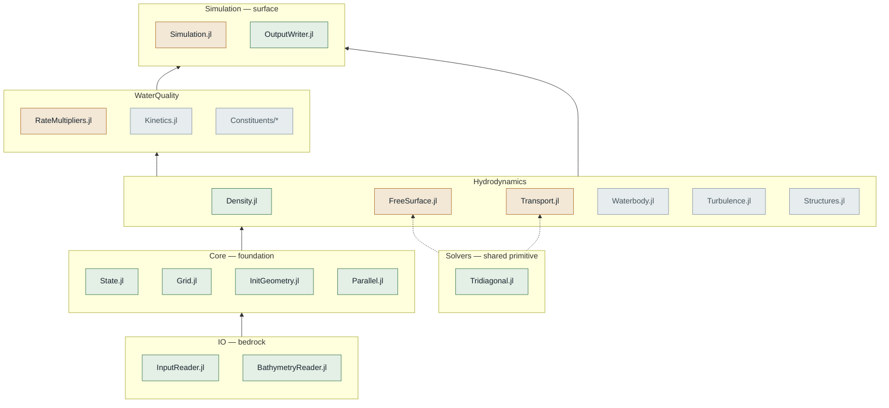

# W2J — CE-QUAL-W2 in Julia

A from-scratch Julia reimplementation of [CE-QUAL-W2](https://www.erdc.usace.army.mil/Locations/CHL/CE-QUAL-W2/),
USACE's 2D laterally-averaged hydrodynamic and water-quality reservoir model. Ported
for speed (multi-core parallelism), differentiability (gradient-based calibration via
`Enzyme.jl`), and architectural flexibility (water-quality kinetics decoupled from the
grid layer).

**Status**: first-cut reduced-physics hydrodynamic run — free surface, momentum, and
temperature transport — works end-to-end against real Detroit Reservoir data, threaded,
498/498 tests passing. Not yet a full physics port; see [Module Status](../../wiki/Module-Status)
for exactly what's real vs. a deliberately-flagged placeholder in each module.

---

## Quick start

```bash
cd W2J
julia --project=. -e "using Pkg; Pkg.instantiate()"
julia --project=. -e "using Pkg; Pkg.test()"
```

Verified on Julia 1.11.3. A few things that trip people up on a fresh clone:

- `Project.toml`'s package UUID must be a real generated UUID, not `00000000-...` —
  Julia's loader silently refuses to resolve the all-zero placeholder.
- `test/Project.toml` needs an explicit `Test` stdlib entry with its *real* UUID
  (`8dfed614-e22c-5e08-85e1-65c5234f0b40`) for `Pkg.test()`'s sandboxed environment to
  resolve.
- `Plots` is a real dependency (`Plotting/LongitudinalProfile.jl`) — the first
  `instantiate`/`test` compiles the full GR/Qt6 stack, budget a few minutes.

To run the zero-flow sanity check that produces real TSR CSV output for Detroit:

```julia
using W2J
g, geom, tc = W2J.InputReader.read_control_file("DetroitReservoir/w2_con.csv")
W2J.InputReader.allocate_geometry!(g, geom)
W2J.BathymetryReader.read_bathymetry!(geom, g, "DetroitReservoir/InputFiles/bth1.csv", 1)
g, geom, net = W2J.init_geometry!(g, geom)
W2J.compute_dlxrho!(g, geom)
W2J.allocate_hydro_state!(g)
W2J.run_zero_flow_sanity_check!(g, geom, net, tc;
    nsteps=2000, output_dir="DetroitReservoir/Outputs", output_segments=[6, 15, 23, 29])
```

---

## Architecture

Read bottom-to-top, like a water column: input files at the bed, the physics solve
through the middle depths, the timestepping driver at the surface. Color = validation
status, not correctness of the idea — a green box has been checked against real data or
known reference values; an amber box has real formulas for its core but real, flagged
gaps; a grey box hasn't been started.



`Tridiagonal.jl` and `Parallel.jl` are drawn as shared primitives rather than another
layer — nearly every physics module reaches into them, so stacking them inside the
layer diagram would misstate the dependency direction. See [Module Status](../../wiki/Module-Status)
for the file-by-file detail behind every box above.

### Current `hydrodynamic_step!` call order

```
density → pressure → gravity → pressure gradient → free-surface solve → velocity update
```

Temperature transport (`temperature_transport!`) is validated standalone but not yet
wired into this loop.

---

## The Three Pillars

1. **Parallel processing** — multi-core speedup via per-cell kinetics and per-segment
   tridiagonal solves (confirmed embarrassingly parallel for both). Threaded only above
   an empirically benchmarked size threshold — naive always-threading measured *slower*
   on Detroit's small grid, see [Module Status](../../wiki/Module-Status).
2. **Differentiable programming** — gradient-based calibration via `Enzyme.jl`. Requires
   type-stable code and no global mutable state.
3. **Architectural flexibility** — kinetics functions are spatially agnostic (cell state
   in, rate terms out), so they can plug into a future transport engine without
   rewriting ecology math.

Full rationale and the numbered architecture-decision log live in `CLAUDE.md`.

---

## Package structure

```
W2J/
├── Project.toml
├── src/
│   ├── W2J.jl                  — module entry point
│   ├── Core/                   — shared state, geometry, branch topology, threading
│   ├── Solvers/                — Tridiagonal.jl, the one shared numerical primitive
│   ├── Hydrodynamics/          — Density, FreeSurface, Transport, + stubs
│   ├── WaterQuality/           — rate multipliers + kinetics (mostly stubs)
│   ├── IO/                     — control-file + bathymetry readers, TSR CSV writer
│   ├── Plotting/                — longitudinal-profile debugging tool
│   └── Simulation.jl           — timestepping driver
├── test/runtests.jl
└── tools/
    ├── xlsx_to_yaml/            — standalone Excel→YAML converter
    └── review_config/           — standalone control-file validator
```

See [Module Status](../../wiki/Module-Status) for the current implementation state of
every file above.

---

## Design principles

- **No global mutable state.** Everything threaded explicitly through structs
  (`Core/State.jl`), replacing `w2modules.F90` + the `ENTRY`-shared-state pattern that
  has no Julia equivalent.
- **Kinetics functions are spatially agnostic.** Local cell state in, rate terms out —
  no `(K,I)` indexing assumptions baked into the water-quality math itself.
- **Shared numerical primitives are ported once.** `Solvers/Tridiagonal.jl` is
  implemented a single time and reused everywhere `TRIDIAG` was called in the original
  — not reimplemented per call site as in the Fortran source.
- **Field names mirror Fortran.** `W2Global`/`W2Geometry` field names are kept identical
  to the Fortran source (`NWB`, `KTWB`, `BHR1`, ...) so the existing W2 user manual and
  control-file labels cross-reference directly, with zero translation.
- **Architecture (CPU/GPU) is an explicit, swappable argument**, not baked into kernel
  logic — modeled on Oceananigans.jl's `CPU`/`GPU{D}` pattern.

---

## Test data

`DetroitReservoir/` is the primary validation case: `w2_con.csv` (control file),
`InputFiles/bth1.csv` (bathymetry), and the source `.xlsm` workbook. Every module status
claim in this repo is checked against this real reservoir, not synthetic data — the one
exception is generality checks (e.g. `branch_processing_order`'s topological sort),
which also run against a synthetic reversed-branch-numbering topology specifically to
prove they don't just work for Detroit's coincidentally-convenient numbering.

---

## Documentation map

| Doc | What's in it |
|---|---|
| This file | Quick start, architecture diagram, package structure, design principles |
| [Wiki: Module Status](../../wiki/Module-Status) | Every module's Fortran source, porting tier, and an honest real-vs-placeholder account |
| [Wiki: Progress Tracker](../../wiki/Progress-Tracker) | Chronological build/validate/fix log |
| [Wiki: Tools](../../wiki/Tools) | `xlsx_to_yaml` and `review_config` deep dives |
| `CLAUDE.md` | Session-to-session working notes for AI-assisted development on this project |
